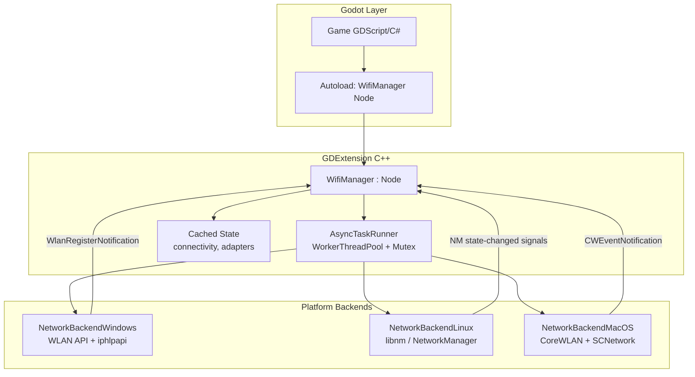
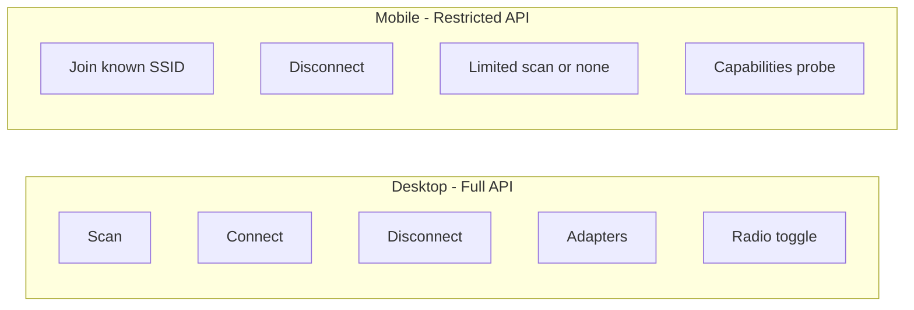

> Evolve the existing WifiGD GDExtension from a synchronous RefCounted API into an async Node-based autoload singleton, complete the Windows backend gaps, implement Linux via libnm (NetworkManager), stub macOS for CoreWLAN, and define a phased roadmap for additional features and future mobile support.

# WifiGD Cross-Platform Async Wi-Fi Manager Plan

## Current State

The project already has a working scaffold:

- **GDExtension entry**: [`src/register_types.cpp`](src/register_types.cpp) registers `WifiManager` as `RefCounted`
- **Platform abstraction**: [`src/platform/network_backend.h`](src/platform/network_backend.h) with Windows/Linux/macOS backends
- **Windows**: partial WLAN API implementation in [`src/platform/windows/network_backend_windows.cpp`](src/platform/windows/network_backend_windows.cpp) (scan, profile-based connect, disconnect, adapters)
- **Linux/macOS**: stubs returning "not yet implemented"
- **Demo**: manually instantiates `WifiManager.new()` in [`demo/scripts/main.gd`](demo/scripts/main.gd)

**Gap vs. your goals**: API is synchronous, not autoload-ready (`RefCounted` has no signals/tree lifecycle), Linux/macOS unimplemented, Windows connect lacks WPA2 profile creation, no event-driven connectivity updates.

---

## Target Architecture



### Key design decisions

| Decision | Choice | Rationale |
|----------|--------|-----------|
| Public class base | `Node` (not `RefCounted`) | Required for autoload scene, signals, `_notification`, optional `_process` polling fallback |
| Async model | Signal-based request/response | Native Godot pattern; GDScript can `await manager.scan_completed` |
| Threading | `WorkerThreadPool` native tasks | Keeps blocking platform I/O off main thread per multithreading rules |
| Linux stack | **libnm** (link runtime `libnm.so`) | Build needs `libnm-dev`; **end users do not need dev packages** — any NetworkManager desktop already has `libnm` runtime. Enables D-Bus signals for connection state. |
| Backend interface | Sync methods on worker thread only | `NetworkBackend` stays synchronous; `WifiManager` wraps all calls in async tasks |

---

## Phase 1: Async Node API + Autoload (Foundation)

### 1.1 Refactor `WifiManager` to `Node`

Change [`src/wifi_manager.h`](src/wifi_manager.h) / [`src/wifi_manager.cpp`](src/wifi_manager.cpp):

- Inherit `godot::Node` instead of `RefCounted`
- Add `GDCLASS(WifiManager, Node)`
- Add thread-safe `Mutex` around backend access
- Add cached properties updated after async ops and platform events

### 1.2 Async request API (replaces blocking calls)

| Old (sync) | New (async) | Completion signal |
|------------|-------------|-------------------|
| `scan_wifi_networks()` | `scan_wifi_networks_async(adapter_id="")` | `scan_completed(networks: Array, error: int)` |
| `connect_to_wifi(ssid, password)` | `connect_to_wifi_async(ssid, password, adapter_id="")` | `connect_completed(error: int)` |
| `disconnect_from_wifi()` | `disconnect_from_wifi_async(adapter_id="")` | `disconnect_completed(error: int)` |
| `get_network_adapters()` | `fetch_adapters_async()` | `adapters_updated(adapters: Array, error: int)` |
| `get_connectivity_info()` | `refresh_connectivity_async()` | `connectivity_updated(info: Dictionary)` |
| `set_wifi_enabled(bool)` | `set_wifi_enabled_async(bool)` | `wifi_enabled_changed(enabled: bool, error: int)` |

Keep **fast sync reads** of cached state (non-blocking):

- `get_cached_connectivity() -> Dictionary`
- `get_cached_adapters() -> Array`
- `get_connection_state() -> int` (enum constant)
- `is_wifi_enabled() -> bool` (cached where possible)
- `get_last_error() -> String`
- `get_active_adapter_id() -> String`

### 1.3 Event signals (push model)

```gdscript
signal connectivity_changed(info: Dictionary)
signal connection_state_changed(state: int, ssid: String)
signal wifi_enabled_changed(enabled: bool)
signal scan_completed(networks: Array, error: int)
signal connect_completed(error: int)
signal disconnect_completed(error: int)
signal adapters_updated(adapters: Array, error: int)
signal operation_failed(operation: String, error: int, message: String)
```

Platform backends register listeners on `_ready()` / tear down on `_exit_tree()`:

- **Windows**: `WlanRegisterNotification` for connect/disconnect/scan complete
- **Linux**: libnm `NMClient` signals (`device-state-changed`, `access-point-added/removed`)
- **macOS**: `CWWiFiClient` delegate callbacks

Fallback: throttled `_process` poll (e.g. every 2s) when event APIs unavailable.

### 1.4 Async task implementation pattern

```cpp
// Pseudocode for wifi_manager.cpp
void WifiManager::scan_wifi_networks_async(const String &adapter_id) {
    pending_scan_++;
    WorkerThreadPool *pool = WorkerThreadPool::get_singleton();
    int64_t task = pool->add_native_task(_scan_task_trampoline, task_data);
    // trampoline runs backend->scan_wifi_networks(), stores result,
    // call_deferred("_emit_scan_completed", ...)
}
```

- One in-flight guard per operation type (reject or queue duplicate scans)
- All `emit_signal` / `call_deferred` on main thread only
- Structured `WifiError` enum bound as constants (`OK`, `PERMISSION_DENIED`, `TIMEOUT`, `ADAPTER_NOT_FOUND`, `NETWORK_NOT_FOUND`, `ALREADY_CONNECTED`, `PLATFORM_UNSUPPORTED`)

### 1.5 Autoload setup

Add [`addons/WifiGD/wifi_manager_autoload.tscn`](addons/WifiGD/wifi_manager_autoload.tscn) — root node type `WifiManager`.

Register in [`demo/project.godot`](demo/project.godot):

```ini
[autoload]
WifiManager="*res://addons/WifiGD/wifi_manager_autoload.tscn"
```

Usage from any script:

```gdscript
func _ready() -> void:
    WifiManager.scan_completed.connect(_on_scan_done)
    WifiManager.scan_wifi_networks_async()

func _on_scan_done(networks: Array, error: int) -> void:
    if error == WifiManager.OK:
        for net in networks:
            print(net["ssid"], net["signal_strength"])
```

Optional GDScript helper in [`addons/WifiGD/wifi_await.gd`](addons/WifiGD/wifi_await.gd) for ergonomic `await`:

```gdscript
static func scan() -> Array:
    return await WifiManager.scan_completed
```

### 1.6 Extend data model

Update [`src/network_types.h`](src/network_types.h) / [`src/network_types.cpp`](src/network_types.cpp):

**WifiNetwork** additions:
- `frequency_mhz`, `channel`, `band` (`"2.4"`, `"5"`, `"6"`)
- `is_hidden`, `max_bitrate_mbps`
- `adapter_id` (which radio saw it)

**NetworkAdapter** additions:
- `id` (platform handle: GUID string / `wlan0` / device path)
- `driver`, `supports_scan`, `supports_connect`
- `connected_ssid`, `signal_strength` (when associated)

**New: `SavedNetwork`** (for profile management):
- `ssid`, `security_type`, `is_autoconnect`, `last_connected`

---

## Phase 2: Windows Backend Completion

File: [`src/platform/windows/network_backend_windows.cpp`](src/platform/windows/network_backend_windows.cpp)

| Task | API | Notes |
|------|-----|-------|
| WPA2-PSK connect | `WlanSetProfile` + `WlanConnect` | Build XML profile from SSID/password; replace profile-name-only connect |
| Multi-adapter | `adapter_id` param | Map GUID string ↔ interface; stop hardcoding `[0]` |
| BSSID connect | `WLAN_CONNECTION_PARAMETERS.pDesiredBssid` | Optional param on `connect_to_wifi_async` |
| Scan wait | `WlanRegisterNotification` + `WLAN_NOTIFICATION_SOURCE_ACM` | Wait for `wlan_notification_acm_scan_complete` instead of immediate read |
| Radio toggle | `WlanSetInterface` `wlan_intf_opcode_radio_state` | Document admin privilege requirement; return `PERMISSION_DENIED` |
| Security mapping | Parse `WLAN_AVAILABLE_NETWORK` auth/cipher | Map to `WPA2`, `WPA3`, `WEP`, `Open` strings |
| Event listener | `WlanRegisterNotification` | Feed `WifiManager` connectivity signals |

---

## Phase 3: Linux Backend (NetworkManager via libnm)

File: [`src/platform/linux/network_backend_linux.cpp`](src/platform/linux/network_backend_linux.cpp) (significant rewrite)

### Build changes ([`SConstruct`](SConstruct))

```python
elif env["platform"] == "linux":
    env.ParseConfig("pkg-config --cflags --libs libnm")
    # Runtime dep: libnm.so (ships with NetworkManager)
```

**Developer deps**: `libnm-dev` (Debian/Ubuntu), `NetworkManager-libnm` (Fedora).  
**End-user deps**: NetworkManager running + polkit permission for connect (standard desktop). No dev headers.

### Implementation map

| Feature | libnm API |
|---------|-----------|
| NM availability check | `nm_client_new` + error handling |
| Adapter enumeration | `nm_client_get_devices()` → filter `NM_DEVICE_TYPE_WIFI` |
| Radio state | `nm_device_wifi_get_enabled` / `nm_device_wifi_set_enabled` |
| Scan | `nm_device_wifi_request_scan()` + wait for `last-scan` property / `access-point-added` |
| Network list | `nm_device_wifi_get_access_points()` → SSID, BSSID, strength, frequency, security flags |
| Connect | `nm_client_add_and_activate_connection_async()` with `802-11-wireless` + `wifi-security` settings |
| Disconnect | `nm_device_disconnect()` |
| Connectivity | Active connection → `NM_ACTIVE_CONNECTION`, IP4 config from `NMIP4Config` |
| Events | `g_signal_connect` on `NMClient`, `NMDeviceWifi` |

### Linux-specific concerns

- **Polkit**: connect/disconnect may prompt auth dialog; surface `PERMISSION_DENIED` with actionable message
- **IWD fallback**: out of scope for v1; detect non-NM stack and return `PLATFORM_UNSUPPORTED` with clear error
- **Headless/kiosk**: document `nmcli` polkit rules for unattended connect if needed later
- **GLIB main loop**: run NM callbacks on a dedicated `GMainContext` thread; marshal to Godot main thread via `call_deferred`

### Adapter ID format

Use device interface name (`wlan0`) as stable `id`; store `NMDevice*` mapping internally.

---

## Phase 4: macOS Backend (CoreWLAN)

File: [`src/platform/macos/network_backend_macos.cpp`](src/platform/macos/network_backend_macos.cpp)

| Feature | API |
|---------|-----|
| Scan | `CWInterface scanForNetworksWithName:` |
| Connect | `CWNetwork` + `connectToNetwork:password:` (user may need admin for some networks) |
| Disconnect | `CWInterface disassociate` |
| Adapters | `CWWiFiClient interfaceNames` |
| Events | `CWWiFiClientDelegate` callbacks |
| IP info | `getifaddrs` + `SCNetworkConfiguration` |

macOS Frameworks already linked in [`SConstruct`](SConstruct): `CoreWLAN`, `SystemConfiguration`, `Network`.

---

## Phase 5: Demo + Distribution

- Rewrite [`demo/scripts/main.gd`](demo/scripts/main.gd) to use autoload + async signals/`await`
- Add connectivity live-update label bound to `connectivity_changed`
- Add adapter picker `OptionButton` for multi-adapter platforms
- Build release binaries for win/linux/macos in CI (GitHub Actions matrix)
- Document runtime requirements per platform in `plugin.cfg` description (not a new README unless requested)

---

## Planned Additional Features (Roadmap)

Grouped by priority beyond your core requirements:

### Near-term (high value, fits current architecture)

- **Saved network management**: list, forget, set autoconnect priority
- **Connect by BSSID**: disambiguate duplicate SSIDs
- **Hidden SSID connect**: flag on `connect_to_wifi_async`
- **Active adapter selection**: `set_active_adapter(id)` persisted on singleton
- **Capability probe**: `get_platform_capabilities() -> Dictionary` (can_scan, can_connect, can_toggle_radio, needs_admin, supports_eap)
- **Connection timeout**: `connect_to_wifi_async(..., timeout_sec=30)`
- **Normalized RSSI**: map platform values to 0–100 consistently
- **Internet reachability**: optional HEAD request or platform-specific check (beyond link-up)
- **Error taxonomy**: typed error codes with human-readable `get_error_message(code)`

### Medium-term

- **Enterprise WPA (802.1X/EAP)**: PEAP/TTLS — complex, per-platform; gate behind capability flag
- **Static IP / DNS override**: NM connection settings / Windows netsh / macOS SCPreferences
- **Hotspot / tethering**: platform-gated (Windows Hosted Network, NM hotspot, macOS Internet Sharing)
- **Metered connection detection**: Windows cost flags, NM metered property
- **MAC randomization status**: privacy feature visibility
- **Periodic signal monitor**: `start_signal_monitor(interval_ms)` → `signal_strength_updated`

### Future mobile (separate backends)

| Platform | API | Critical limitations |
|----------|-----|---------------------|
| **Android** | `WifiManager`, `WifiNetworkSpecifier` (API 29+) | Requires JNI bridge or Android plugin; location permission for scan on older APIs; no raw BSSID connect on newer APIs |
| **iOS** | `NEHotspotConfiguration` | **Apple restricts scanning**; can only join known SSIDs with user consent; no full network list like desktop |

Recommend introducing `NetworkBackendAndroid` / `NetworkBackendIOS` behind the same `NetworkBackend` interface, with `get_platform_capabilities()` reporting reduced feature set on mobile.



---

## File Change Summary

| File | Changes |
|------|---------|
| [`src/wifi_manager.h/cpp`](src/wifi_manager.h) | `Node` base, async methods, signals, task runner, cached state |
| [`src/network_types.h/cpp`](src/network_types.h) | Extended structs, `WifiError` enum, `SavedNetwork` |
| [`src/platform/network_backend.h`](src/platform/network_backend.h) | Optional `start/stop_listeners()`, `adapter_id` params, `get_capabilities()` |
| [`src/platform/linux/network_backend_linux.cpp`](src/platform/linux/network_backend_linux.cpp) | Full libnm implementation |
| [`src/platform/windows/network_backend_windows.cpp`](src/platform/windows/network_backend_windows.cpp) | Profile creation, events, multi-adapter |
| [`src/platform/macos/network_backend_macos.cpp`](src/platform/macos/network_backend_macos.cpp) | CoreWLAN implementation |
| [`SConstruct`](SConstruct) | Linux `pkg-config libnm` |
| [`addons/WifiGD/wifi_manager_autoload.tscn`](addons/WifiGD/wifi_manager_autoload.tscn) | New autoload scene |
| [`demo/project.godot`](demo/project.godot) | Autoload entry |
| [`demo/scripts/main.gd`](demo/scripts/main.gd) | Async demo |

---

## Suggested Implementation Order

1. **Phase 1** — Node + async + signals + autoload (unblocks all game integration)
2. **Phase 3** — Linux libnm (your first Linux target)
3. **Phase 2** — Windows gaps (WPA2 profiles, events) — can parallelize with Phase 3
4. **Phase 4** — macOS CoreWLAN
5. **Phase 5** — Demo polish + release builds
6. **Roadmap features** — incrementally by priority

---

## Risk Register

| Risk | Mitigation |
|------|------------|
| Linux non-NM environments (IWD, connman) | Capability probe + clear `PLATFORM_UNSUPPORTED` error |
| Windows admin for radio toggle | Document; return `PERMISSION_DENIED`; don't block other ops |
| iOS App Store Wi-Fi restrictions | Separate mobile backend; document NEHotspotConfiguration-only scope |
| Godot main thread safety | Never call backend from main thread except cached reads; all mutations via worker |
| libnm event thread | Dedicated GLib thread + `call_deferred` marshaling |

## Todos

- [ ] **phase1-node-async** — Refactor WifiManager to Node: async methods, signals, WorkerThreadPool task runner, cached state, WifiError enum
- [ ] **phase1-autoload** — Add wifi_manager_autoload.tscn, register autoload in demo/project.godot, optional wifi_await.gd helper
- [ ] **phase1-data-model** — Extend network_types (adapter_id, frequency, band, SavedNetwork) and update to_dict serialization
- [ ] **phase2-windows** — Complete Windows backend: WPA2 profile creation, multi-adapter, WlanRegisterNotification events, security mapping
- [ ] **phase3-linux-libnm** — Implement Linux NetworkBackend via libnm: scan, connect, disconnect, adapters, radio, NM event signals; update SConstruct
- [ ] **phase4-macos** — Implement macOS CoreWLAN backend with delegate-based connectivity events
- [ ] **phase5-demo** — Rewrite demo to async autoload pattern with adapter picker and live connectivity updates
- [ ] **roadmap-features** — Plan follow-up PRs: saved networks, BSSID connect, capabilities probe, connection timeout, mobile backend stubs
